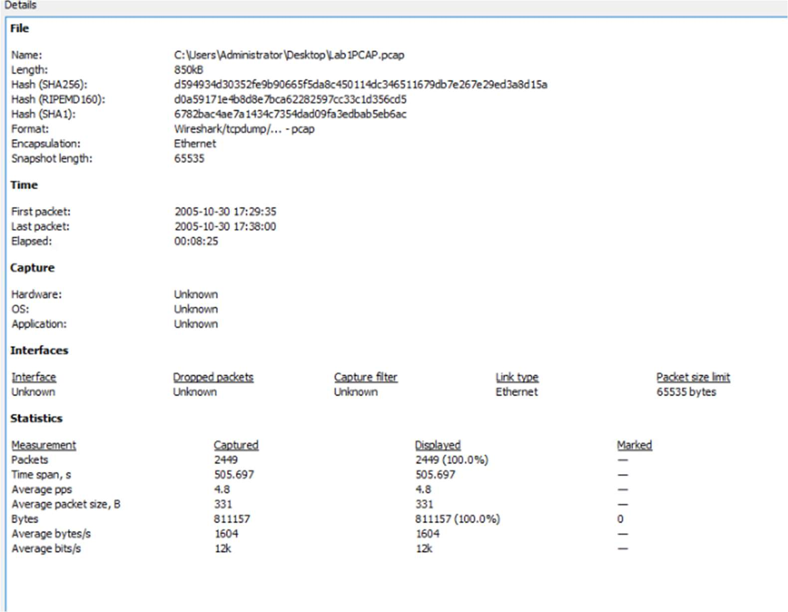
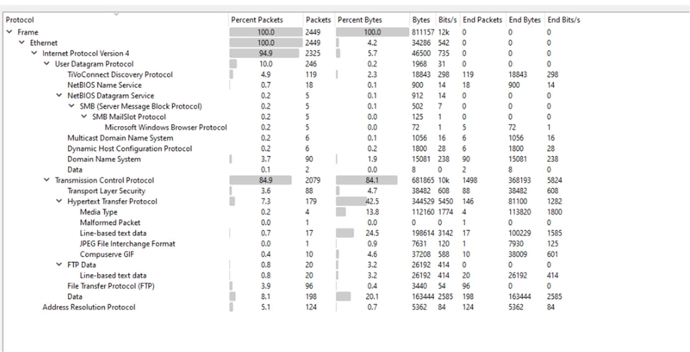
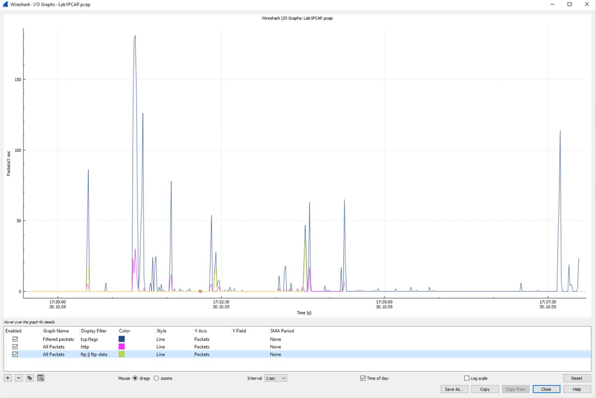
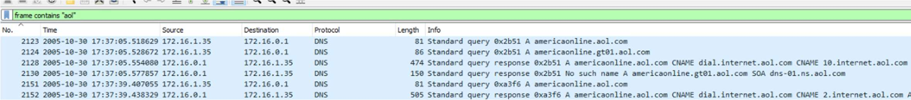
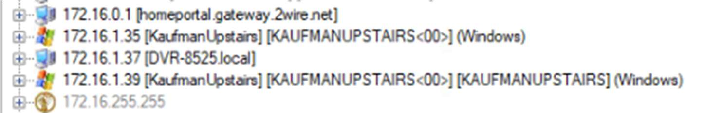
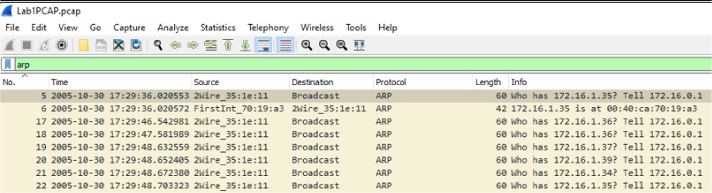
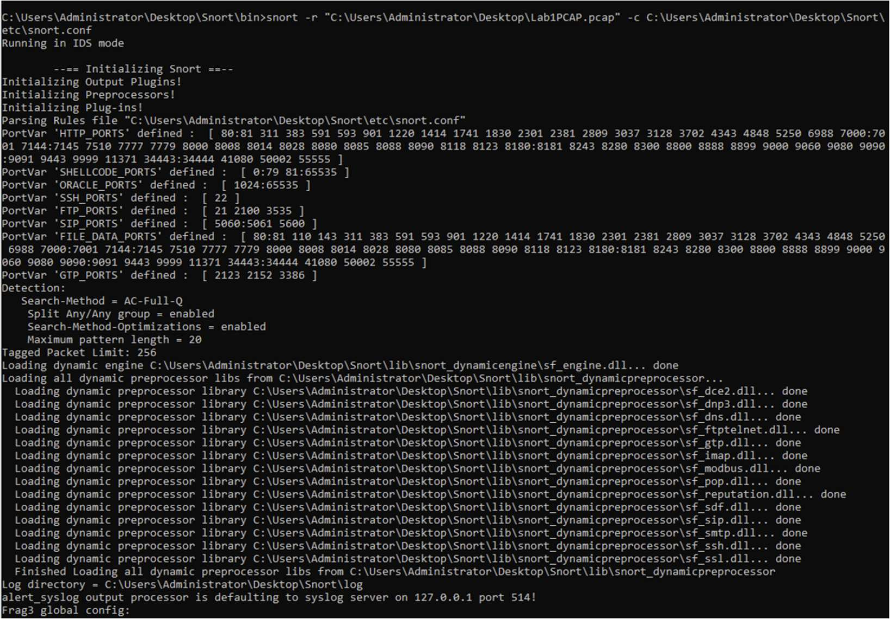
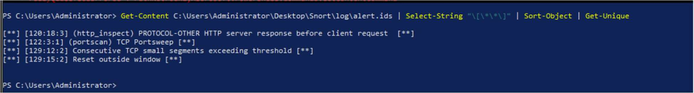
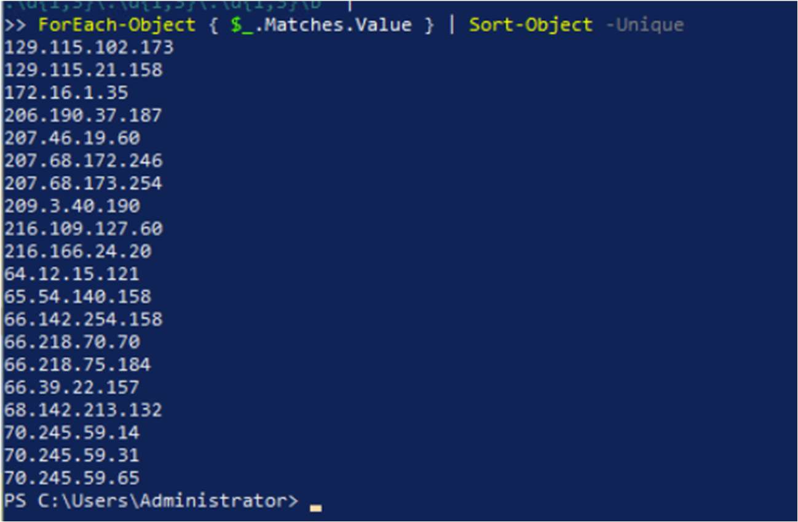

# Event Analysis Lab

**Course:** IS-3523: Intrusion Detection and Response  
**Date:** February 17 2025
**Author:** Brandon Nelson

## 1 Introduction

This lab presents a hands‑on investigation of a packet capture (PCAP) obtained from a small home network.  The objectives were to examine overall traffic statistics, identify hosts and services, investigate anomalies reported by Snort and NetworkMiner, and determine whether any malicious activity occurred.  By systematically using Wireshark, NetworkMiner and Snort, I reconstructed the timeline of network events, mapped devices and protocols, and validated or dismissed potential threats.

## 2 Environment and Tools

The analysis was performed on a Kali Linux workstation configured with the following software:

* **Wireshark** – Version 4.x packet analyser used to inspect packet captures and produce statistics.
* **NetworkMiner** – Version 2.x network forensics tool used to passively enumerate hosts, sessions and files.
* **Snort IDS** – Version 2.x intrusion‑detection system running in offline mode to generate alerts from the PCAP.
* **PCAP file** – A capture lasting roughly 8 minutes and 25 seconds recorded on 30 October 2005.  The trace contains 2 449 packets totaling about 811 KB.
* **LAN environment** – Private subnet `172.16.0.0/16`.  The primary workstation `KAUFMANUPSTAIRS` (172.16.1.35) runs Windows.  Additional devices include a DVR (172.16.1.37), an IP camera (172.16.1.39) and a gateway at 172.16.0.1.

All analysis occurred in an isolated lab with no impact on live systems.

## 3 Procedure

### 3.1 Initial inspection and capture statistics

I loaded the PCAP into Wireshark and reviewed the **Capture File Properties**.  The session lasted from **17:29:35 to 17:38:00** on 30 October 2005, covering **2 449 packets** and **811 157 bytes**.  Figure 1 shows the summary of packets per second and bytes per second.

### 3.2 Protocol hierarchy and I/O graph

Using **Statistics → Protocol Hierarchy**, I analysed the distribution of protocols.  The vast majority of traffic was **TCP** (≈85 %), with **UDP** (~10 %), **HTTP** (~7 %), **FTP** (~8 %) and **TLS** (~4 %) making up the remainder.  The hierarchy also revealed minor protocols such as NetBIOS/SMB, ARP and DNS.  Figure 2 displays the protocol breakdown.

Next, I plotted the **I/O Graph** to visualise throughput over time.  A notable spike occurred around **17:31:09**, where a burst of HTTP GET requests, TLS handshakes and TCP retransmissions caused throughput to increase rapidly.  This spike corresponded to the user browsing multiple web pages in quick succession.  Figure 3 illustrates the I/O graph with the traffic spike circled.

### 3.3 DNS and application analysis

Inspecting DNS queries revealed connections to **dial.internet.aol.com** and **2wire.net**, indicating that the network used an AOL dial‑up/DSL modem.  I also observed HTTP requests to download images and HTML content from these sites.  Figure 4 shows example DNS request and response details.

### 3.4 Host identification and LAN mapping

Using Wireshark’s ARP and NBNS traffic along with NetworkMiner, I enumerated devices on the LAN.  The primary workstation, **KAUFMANUPSTAIRS**, had IP **172.16.1.35** and MAC `00:0c:f1:93:58:31`.  A **DVR/TiVo** device at **172.16.1.37** and an **IP camera** at **172.16.1.39** were also active.  Two addresses (172.16.1.34 and 172.16.1.36) appeared only in ARP requests, suggesting dormant or disconnected devices.  Figure 5 presents the host table from NetworkMiner, while Figure 6 shows Wireshark’s ARP cache.

### 3.5 Traffic anomalies and ARP investigation

NetworkMiner flagged a potential ARP poisoning attack because the IP camera (172.16.1.39) exhibited two different MAC addresses.  To verify this, I examined the ARP packets in Wireshark and confirmed that there were no duplicate replies; the MAC change likely resulted from the device reconnecting or using multiple interfaces.  Thus, the alert was a **false positive**.  Furthermore, the I/O graph spike and numerous TCP retransmissions were attributed to normal web browsing activity rather than malicious congestion.

### 3.6 Intrusion‑detection analysis with Snort

I ran Snort in offline mode against the PCAP using the default ruleset.  Snort generated several alerts:

* **HTTP server response before client request** – 261 occurrences.  These alerts flagged cases where the server responded before a proper HTTP request, likely due to browser prefetching and caching mechanisms.
* **Reset outside window** – 109 occurrences.  These indicated TCP RST packets that fell outside the expected sequence window; they were associated with legitimate session terminations and not malicious activity.
* **Consecutive TCP small segments exceeding threshold** – 14 occurrences.  This signature usually points to fragmentation attempts, but in this case it resulted from small HTTP packets and ACKs.
* **TCP Portsweep** – 3 occurrences.  These alerts suggested a port scan but mapped to normal service discovery performed by the DVR.

Figure 7 shows Snort processing the PCAP, while Figure 8 lists the generated alerts.

To cross‑check the alerts, I extracted the IP addresses involved in each category (Figure 9).  This mapping helped confirm that the suspicious traffic originated from known devices on the LAN and not from external attackers.

## 4 Analysis

The investigation revealed that the network traffic predominantly consisted of normal home‑user activity.  The spike in throughput was caused by a user loading several web pages in rapid succession, generating HTTP GET requests, TLS negotiations and corresponding retransmissions.  The ARP poisoning alert was a false positive stemming from a device reconnecting with a different MAC address.  Snort alerts were mainly related to protocol quirks and small segments rather than exploitation attempts.  No evidence of malicious exploitation, lateral movement or data exfiltration was found.

However, the capture exposed several **security weaknesses**:

* **Unencrypted protocols** – HTTP and anonymous FTP traffic were present, exposing credentials and content to interception.
* **Outdated infrastructure** – The use of dial‑up/DSL services and legacy protocols (NetBIOS/SMB) indicates the network lacks modern security controls.
* **Lack of segmentation** – All devices resided on the same subnet, increasing the attack surface.

## 5 Conclusion

This lab demonstrated the process of analysing network events and validating intrusion‑detection alerts.  By leveraging Wireshark, NetworkMiner and Snort, I measured traffic statistics, identified hosts and services, correlated alerts with packet context and differentiated benign anomalies from genuine threats.  Although the environment contained outdated protocols and insecure services, no active attacks were detected.  The exercise highlighted the importance of using IDS alerts as investigative leads rather than definitive evidence of compromise.  Key takeaways include the need to enforce encryption (HTTPS/SFTP), disable anonymous FTP, maintain firmware updates and monitor ARP tables.  These skills directly support SOC analyst responsibilities in log analysis, threat detection, enumeration, exploitation validation and packet analysis.
